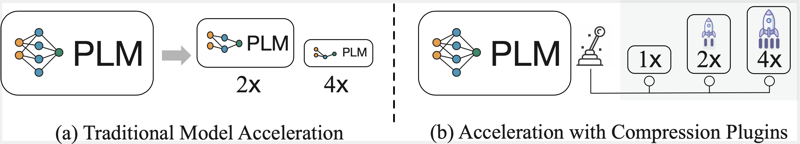

# Variator: Accelerating Pre-trained Models with Plug-and-Play Compression Modules
The code and checkpoints of our paper "Variator: Accelerating Pre-trained Models with Plug-and-Play Compression Modules".


## Quick Links

* [Overview](#overview)
* [Requirements](#requirements)
* [Folder Structure](#folder-structure)
* [Plugin Pre-training](#plugin-pre-training)
* [Plugin Adaptation](#plugin-adaptation)
* [Citation](#citation)

## Overview



Pre-trained language models (PLMs) have achieved remarkable results on NLP tasks but at the expense of huge parameter sizes and the consequent computational costs. In this paper, we propose Variator, a parameter-efficient acceleration method that enhances computational efficiency through plug-and-play compression plugins. Compression plugins are designed to reduce the sequence length via compressing multiple hidden vectors into one and trained with original PLMs frozen. Different from traditional model acceleration methods, which compress PLMs to smaller sizes, Variator offers two distinct advantages: (1) In real-world applications, the plug-and-play nature of our compression plugins enables dynamic selection of different compression plugins with varying acceleration ratios based on the current workload. (2) The compression plugin comprises a few compact neural network layers with minimal parameters, significantly saving storage and memory overhead, particularly in scenarios with a growing number of tasks. We validate the effectiveness of Variator on seven datasets. Experimental results show that Variator can save 53% computational costs using only 0.9% additional parameters with a performance drop of less than 2%. Moreover, when the model scales to billions of parameters, Variator matches the strong performance of uncompressed PLMs.

## Requirements
```
bmtrain==0.2.3.post2
model-center==1.0.3
datasets==2.8.0
torch==1.12.1
transformers==4.30.2
```
Here, `bmtrain` is an efficient and distributed training framework for big models , and `model-center` is an efficient transformer implementation based on `bmtrain`. Please refer to [BMTrain](https://github.com/openbmb/bmtrain) and [ModelCenter](https://github.com/openbmb/modelcenter) for details.

## Folder Structure
* **`train_t5.py`**: The entry point of all training and evaluation scripts. The arguments for the `train_t5.py` are as follows:
    | argument       | description                         |
    | -------------- | ----------------------------------- |
    | mode           | `train` or `valid`                  |
    | dataset        | select a dataset in GLUE/SQuAD/Wiki |
    | model-config   | path of PLM from model-center       |
    | checkpoint     | checkpoint path of backbone models   |
    | plugin-path    | checkpoint path of accelerator plugin |
    | data-path      | path of training data               |
    | distil         | the type of loss function (`hidden`, `task-hidden`, `task` or `no`) |
* **`dataset`**: code for reading data into memory
* **`metric`**: code for caomputing evaluation metrics
* **`model`**: code for our models
* **`scripts`**: the training and evaluation scripts.
* **`utils`**: code for pre-processing data and download checkpoints.

## Pluin Pre-training
In our paper, we adopt wikipedia as our pre-training corpus, and we split it into spans with approximate 128 words. The processed corpus can be download from [here](https://thunlp.oss-cn-qingdao.aliyuncs.com/Variator-Compression-Plugin/wikicorpus_128.tar.gz) and put it into the `data` folder.

```
mkdir data
cd data
wget https://thunlp.oss-cn-qingdao.aliyuncs.com/Variator-Compression-Plugin/wikicorpus_128.tar.gz
tar -zxvf wikicorpus_128.tar.gz
```

Then we can run the plugin pre-training with the following command:
```
bash scripts/wiki.sh MODEL_SIZE
```
Here, `MODEL_SIZE` can be `base` or `large`, which means to adopt `T5-base` or `T5-large` as the backbone model. We also provide pre-trained checkpoints in [T5-base-plugin](
https://thunlp.oss-cn-qingdao.aliyuncs.com/Variator-Compression-Plugin/plugins/plugin-t5_base-mux_4.pkl) and [T5-large-plugin](https://thunlp.oss-cn-qingdao.aliyuncs.com/Variator-Compression-Plugin/plugins/plugin-t5_large-mux_4.pkl).

## Plugin Adaptation
We can download the downstream task datasets with:
```
python3 utils/save_data.py
```

Then, before constructing plugins, we need to perfrom downstream task fine-tuning:
```
bash scripts/glue/glue.sh MODEL_SIZE DATASET
```
Here, `DATASET` is supposed to selected from `[mnli, mnli, qqp, qnli, sst2, rte, mrpc, squad]`. The checkpoints will be saved in the `checkpoints/` folder.

Then, we perform plugin adaptation with:
```
bash scripts/glue/glue-mux.sh MODEL_SIZE DATASET
```

## Citation

If you use the code, please cite the following paper:
```
@inproceedings{xiao2023variator,
  title={Variator: Accelerating Pre-trained Models with Plug-and-Play Compression Modules},
  author={Xiao, Chaojun and Luo, Yuqi and Zhang, Wenbin and Zhang, Pengle and Han, Xu and Lin, Yankai and Zhang, Zhengyan and Xie, Ruobing and Liu, Zhiyuan and Sun, Maosong and Zhou, Jie},
  booktitle={Proceedings of EMNLP: Findings},
  year={2023}
}
```